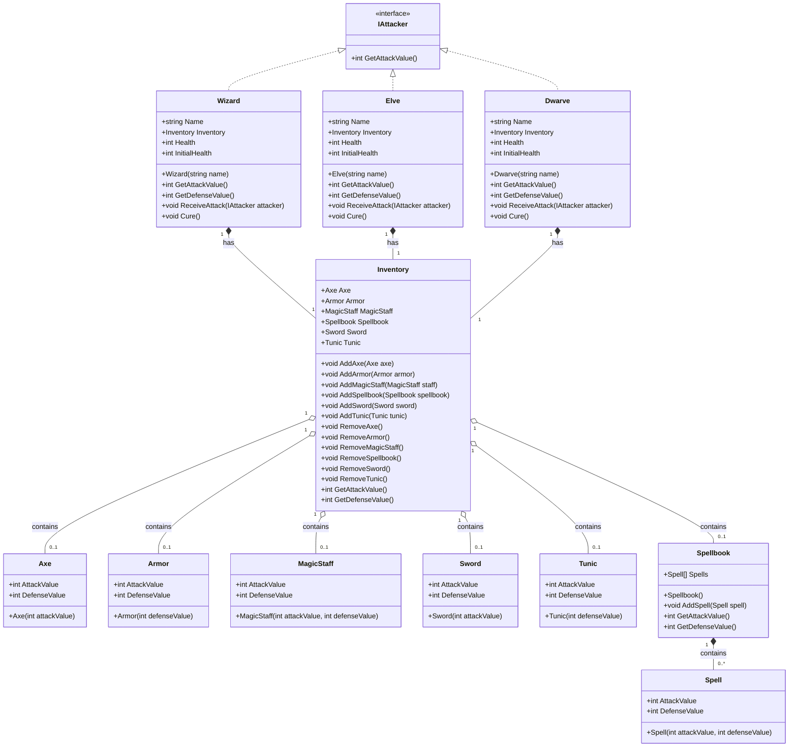

# Diagrama de clases

```mermaid
classDiagram
    class IAttacker {
        <<interface>>
        +int GetAttackValue()
    }

    class Wizard {
        +string Name
        +Inventory Inventory
        +int Health
        +int InitialHealth
        +Wizard(string name)
        +int GetAttackValue()
        +int GetDefenseValue()
        +void ReceiveAttack(IAttacker attacker)
        +void Cure()
    }

    class Elve {
        +string Name
        +Inventory Inventory
        +int Health
        +int InitialHealth
        +Elve(string name)
        +int GetAttackValue()
        +int GetDefenseValue()
        +void ReceiveAttack(IAttacker attacker)
        +void Cure()
    }

    class Dwarve {
        +string Name
        +Inventory Inventory
        +int Health
        +int InitialHealth
        +Dwarve(string name)
        +int GetAttackValue()
        +int GetDefenseValue()
        +void ReceiveAttack(IAttacker attacker)
        +void Cure()
    }

    class Inventory {
        +Axe Axe
        +Armor Armor
        +MagicStaff MagicStaff
        +Spellbook Spellbook
        +Sword Sword
        +Tunic Tunic
        +void AddAxe(Axe axe)
        +void AddArmor(Armor armor)
        +void AddMagicStaff(MagicStaff staff)
        +void AddSpellbook(Spellbook spellbook)
        +void AddSword(Sword sword)
        +void AddTunic(Tunic tunic)
        +void RemoveAxe()
        +void RemoveArmor()
        +void RemoveMagicStaff()
        +void RemoveSpellbook()
        +void RemoveSword()
        +void RemoveTunic()
        +int GetAttackValue()
        +int GetDefenseValue()
    }

    class Axe {
        +int AttackValue
        +int DefenseValue
        +Axe(int attackValue)
    }

    class Armor {
        +int AttackValue
        +int DefenseValue
        +Armor(int defenseValue)
    }

    class MagicStaff {
        +int AttackValue
        +int DefenseValue
        +MagicStaff(int attackValue, int defenseValue)
    }

    class Sword {
        +int AttackValue
        +int DefenseValue
        +Sword(int attackValue)
    }

    class Tunic {
        +int AttackValue
        +int DefenseValue
        +Tunic(int defenseValue)
    }

    class Spell {
        +int AttackValue
        +int DefenseValue
        +Spell(int attackValue, int defenseValue)
    }

    class Spellbook {
        +Spell[] Spells
        +Spellbook()
        +void AddSpell(Spell spell)
        +int GetAttackValue()
        +int GetDefenseValue()
    }

    IAttacker <|.. Wizard
    IAttacker <|.. Elve
    IAttacker <|.. Dwarve

    Wizard "1" *-- "1" Inventory : has
    Elve "1" *-- "1" Inventory : has
    Dwarve "1" *-- "1" Inventory : has

    Inventory "1" o-- "0..1" Axe : contains
    Inventory "1" o-- "0..1" Armor : contains
    Inventory "1" o-- "0..1" MagicStaff : contains
    Inventory "1" o-- "0..1" Spellbook : contains
    Inventory "1" o-- "0..1" Sword : contains
    Inventory "1" o-- "0..1" Tunic : contains
    Spellbook "1" *-- "0..*" Spell : contains
```
