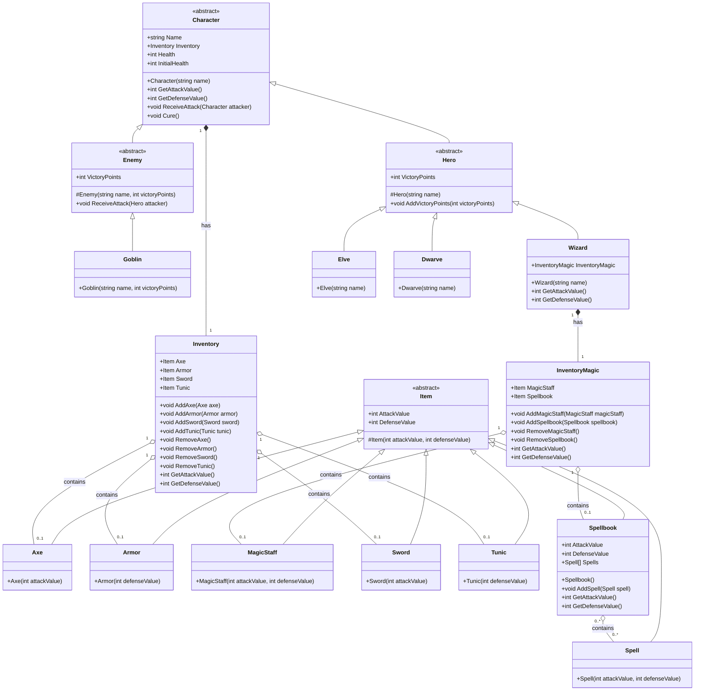

# Diagrama de clases

```mermaid
classDiagram
    class Character {
        <<abstract>>
        +string Name
        +Inventory Inventory
        +int Health
        +int InitialHealth
        +Character(string name)
        +int GetAttackValue()
        +int GetDefenseValue()
        +void ReceiveAttack(Character attacker)
        +void Cure()
    }

    class Hero {
        <<abstract>>
        +int VictoryPoints
        #Hero(string name)
        +void AddVictoryPoints(int victoryPoints)
    }

    class Enemy {
        <<abstract>>
        +int VictoryPoints
        #Enemy(string name, int victoryPoints)
        +void ReceiveAttack(Hero attacker)
    }

    class Goblin {
        +Goblin(string name, int victoryPoints)
    }

    class Wizard {
        +InventoryMagic InventoryMagic
        +Wizard(string name)
        +int GetAttackValue()
        +int GetDefenseValue()
    }

    class Elve {
        +Elve(string name)
    }

    class Dwarve {
        +Dwarve(string name)
    }

    class Inventory {
        +Item Axe
        +Item Armor
        +Item Sword
        +Item Tunic
        +void AddAxe(Axe axe)
        +void AddArmor(Armor armor)
        +void AddSword(Sword sword)
        +void AddTunic(Tunic tunic)
        +void RemoveAxe()
        +void RemoveArmor()
        +void RemoveSword()
        +void RemoveTunic()
        +int GetAttackValue()
        +int GetDefenseValue()
    }

    class InventoryMagic {
        +Item MagicStaff
        +Item Spellbook
        +void AddMagicStaff(MagicStaff magicStaff)
        +void AddSpellbook(Spellbook spellbook)
        +void RemoveMagicStaff()
        +void RemoveSpellbook()
        +int GetAttackValue()
        +int GetDefenseValue()
    }

    class Item {
        <<abstract>>
        +int AttackValue
        +int DefenseValue
        #Item(int attackValue, int defenseValue)
    }

    class Axe {
        +Axe(int attackValue)
    }

    class Armor {
        +Armor(int defenseValue)
    }

    class MagicStaff {
        +MagicStaff(int attackValue, int defenseValue)
    }

    class Sword {
        +Sword(int attackValue)
    }

    class Tunic {
        +Tunic(int defenseValue)
    }

    class Spell {
        +Spell(int attackValue, int defenseValue)
    }

    class Spellbook {
        +int AttackValue
        +int DefenseValue
        +Spell[] Spells
        +Spellbook()
        +void AddSpell(Spell spell)
        +int GetAttackValue()
        +int GetDefenseValue()
    }

    Character <|-- Hero
    Character <|-- Enemy
    Hero <|-- Wizard
    Hero <|-- Elve
    Hero <|-- Dwarve
    Enemy <|-- Goblin
    Item <|-- Axe
    Item <|-- Armor
    Item <|-- MagicStaff
    Item <|-- Sword
    Item <|-- Tunic
    Item <|-- Spell
    Item <|-- Spellbook

    Character "1" *-- "1" Inventory : has
    Wizard "1" *-- "1" InventoryMagic : has

    Inventory "1" o-- "0..1" Axe : contains
    Inventory "1" o-- "0..1" Armor : contains
    InventoryMagic "1" o-- "0..1" MagicStaff : contains
    InventoryMagic "1" o-- "0..1" Spellbook : contains
    Inventory "1" o-- "0..1" Sword : contains
    Inventory "1" o-- "0..1" Tunic : contains
    Spellbook "0..*" o-- "0..*" Spell : contains
```
